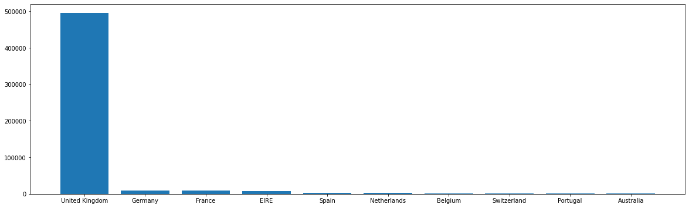
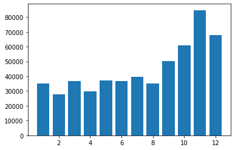

```python
import pandas as pd
import numpy as np
```


```python
import matplotlib.pyplot as plt
%matplotlib inline
```


```python
data = pd.read_excel(r'C:\Users\yifan\Documents\数据分析\Online_Retail.xlsx')
```


```python
data.head()
```


<div>
<style scoped>
    .dataframe tbody tr th:only-of-type {
        vertical-align: middle;
    }

    .dataframe tbody tr th {
        vertical-align: top;
    }

    .dataframe thead th {
        text-align: right;
    }
</style>
<table border="1" class="dataframe">
  <thead>
    <tr style="text-align: right;">
      <th></th>
      <th>InvoiceNo</th>
      <th>StockCode</th>
      <th>Description</th>
      <th>Quantity</th>
      <th>InvoiceDate</th>
      <th>UnitPrice</th>
      <th>CustomerID</th>
      <th>Country</th>
    </tr>
  </thead>
  <tbody>
    <tr>
      <th>0</th>
      <td>574444</td>
      <td>20972</td>
      <td>PINK CREAM FELT CRAFT TRINKET BOX</td>
      <td>11</td>
      <td>2011-11-04 11:41:00</td>
      <td>1.25</td>
      <td>18122.0</td>
      <td>United Kingdom</td>
    </tr>
    <tr>
      <th>1</th>
      <td>551855</td>
      <td>22666</td>
      <td>RECIPE BOX PANTRY YELLOW DESIGN</td>
      <td>2</td>
      <td>2011-05-04 15:08:00</td>
      <td>2.95</td>
      <td>12836.0</td>
      <td>United Kingdom</td>
    </tr>
    <tr>
      <th>2</th>
      <td>568574</td>
      <td>84832</td>
      <td>ZINC WILLIE WINKIE  CANDLE STICK</td>
      <td>12</td>
      <td>2011-09-28 09:15:00</td>
      <td>0.85</td>
      <td>13862.0</td>
      <td>United Kingdom</td>
    </tr>
    <tr>
      <th>3</th>
      <td>552883</td>
      <td>22505</td>
      <td>MEMO BOARD COTTAGE DESIGN</td>
      <td>48</td>
      <td>2011-05-12 10:13:00</td>
      <td>4.25</td>
      <td>14646.0</td>
      <td>Netherlands</td>
    </tr>
    <tr>
      <th>4</th>
      <td>578067</td>
      <td>84077</td>
      <td>WORLD WAR 2 GLIDERS ASSTD DESIGNS</td>
      <td>1</td>
      <td>2011-11-22 15:43:00</td>
      <td>0.63</td>
      <td>NaN</td>
      <td>United Kingdom</td>
    </tr>
  </tbody>
</table>
</div>


```python
data.info()
```

    <class 'pandas.core.frame.DataFrame'>
    RangeIndex: 541909 entries, 0 to 541908
    Data columns (total 8 columns):
     #   Column       Non-Null Count   Dtype         
    ---  ------       --------------   -----         
     0   InvoiceNo    541909 non-null  object        
     1   StockCode    541909 non-null  object        
     2   Description  540455 non-null  object        
     3   Quantity     541909 non-null  int64         
     4   InvoiceDate  541909 non-null  datetime64[ns]
     5   UnitPrice    541909 non-null  float64       
     6   CustomerID   406829 non-null  float64       
     7   Country      541909 non-null  object        
    dtypes: datetime64[ns](1), float64(2), int64(1), object(4)
    memory usage: 33.1+ MB
    


```python
data.isnull().sum()
```


    InvoiceNo           0
    StockCode           0
    Description      1454
    Quantity            0
    InvoiceDate         0
    UnitPrice           0
    CustomerID     135080
    Country             0
    dtype: int64


```python
data.shape
```


    (541909, 8)


```python
data.duplicated().count()
```


    541909


```python
pd.to_datetime(data['InvoiceDate'])
```


    0        2011-11-04 11:41:00
    1        2011-05-04 15:08:00
    2        2011-09-28 09:15:00
    3        2011-05-12 10:13:00
    6        2011-11-17 17:34:00
                     ...        
    541902   2011-10-30 14:05:00
    541905   2011-06-23 10:44:00
    541906   2011-07-19 11:47:00
    541907   2011-09-06 08:34:00
    541908   2011-07-11 15:52:00
    Name: InvoiceDate, Length: 406829, dtype: datetime64[ns]


```python
data.info()
```

    <class 'pandas.core.frame.DataFrame'>
    RangeIndex: 541909 entries, 0 to 541908
    Data columns (total 8 columns):
     #   Column       Non-Null Count   Dtype         
    ---  ------       --------------   -----         
     0   InvoiceNo    541909 non-null  object        
     1   StockCode    541909 non-null  object        
     2   Description  540455 non-null  object        
     3   Quantity     541909 non-null  int64         
     4   InvoiceDate  541909 non-null  datetime64[ns]
     5   UnitPrice    541909 non-null  float64       
     6   CustomerID   406829 non-null  float64       
     7   Country      541909 non-null  object        
    dtypes: datetime64[ns](1), float64(2), int64(1), object(4)
    memory usage: 33.1+ MB
    


```python
data.drop_duplicates()
```


<div>
<style scoped>
    .dataframe tbody tr th:only-of-type {
        vertical-align: middle;
    }

    .dataframe tbody tr th {
        vertical-align: top;
    }

    .dataframe thead th {
        text-align: right;
    }
</style>
<table border="1" class="dataframe">
  <thead>
    <tr style="text-align: right;">
      <th></th>
      <th>InvoiceNo</th>
      <th>StockCode</th>
      <th>Description</th>
      <th>Quantity</th>
      <th>InvoiceDate</th>
      <th>UnitPrice</th>
      <th>CustomerID</th>
      <th>Country</th>
      <th>price</th>
      <th>month</th>
      <th>year</th>
      <th>day</th>
      <th>date</th>
    </tr>
  </thead>
  <tbody>
    <tr>
      <th>0</th>
      <td>574444</td>
      <td>20972</td>
      <td>PINK CREAM FELT CRAFT TRINKET BOX</td>
      <td>11</td>
      <td>2011-11-04 11:41:00</td>
      <td>1.25</td>
      <td>18122.0</td>
      <td>United Kingdom</td>
      <td>13.75</td>
      <td>11</td>
      <td>2011</td>
      <td>4</td>
      <td>2011-11-04</td>
    </tr>
    <tr>
      <th>1</th>
      <td>551855</td>
      <td>22666</td>
      <td>RECIPE BOX PANTRY YELLOW DESIGN</td>
      <td>2</td>
      <td>2011-05-04 15:08:00</td>
      <td>2.95</td>
      <td>12836.0</td>
      <td>United Kingdom</td>
      <td>5.90</td>
      <td>5</td>
      <td>2011</td>
      <td>4</td>
      <td>2011-05-04</td>
    </tr>
    <tr>
      <th>2</th>
      <td>568574</td>
      <td>84832</td>
      <td>ZINC WILLIE WINKIE  CANDLE STICK</td>
      <td>12</td>
      <td>2011-09-28 09:15:00</td>
      <td>0.85</td>
      <td>13862.0</td>
      <td>United Kingdom</td>
      <td>10.20</td>
      <td>9</td>
      <td>2011</td>
      <td>28</td>
      <td>2011-09-28</td>
    </tr>
    <tr>
      <th>3</th>
      <td>552883</td>
      <td>22505</td>
      <td>MEMO BOARD COTTAGE DESIGN</td>
      <td>48</td>
      <td>2011-05-12 10:13:00</td>
      <td>4.25</td>
      <td>14646.0</td>
      <td>Netherlands</td>
      <td>204.00</td>
      <td>5</td>
      <td>2011</td>
      <td>12</td>
      <td>2011-05-12</td>
    </tr>
    <tr>
      <th>4</th>
      <td>578067</td>
      <td>84077</td>
      <td>WORLD WAR 2 GLIDERS ASSTD DESIGNS</td>
      <td>1</td>
      <td>2011-11-22 15:43:00</td>
      <td>0.63</td>
      <td>U</td>
      <td>United Kingdom</td>
      <td>0.63</td>
      <td>11</td>
      <td>2011</td>
      <td>22</td>
      <td>2011-11-22</td>
    </tr>
    <tr>
      <th>...</th>
      <td>...</td>
      <td>...</td>
      <td>...</td>
      <td>...</td>
      <td>...</td>
      <td>...</td>
      <td>...</td>
      <td>...</td>
      <td>...</td>
      <td>...</td>
      <td>...</td>
      <td>...</td>
      <td>...</td>
    </tr>
    <tr>
      <th>541904</th>
      <td>538351</td>
      <td>48173c</td>
      <td>DOORMAT BLACK FLOCK</td>
      <td>1</td>
      <td>2010-12-10 15:17:00</td>
      <td>16.98</td>
      <td>U</td>
      <td>United Kingdom</td>
      <td>16.98</td>
      <td>12</td>
      <td>2010</td>
      <td>10</td>
      <td>2010-12-10</td>
    </tr>
    <tr>
      <th>541905</th>
      <td>557846</td>
      <td>20986</td>
      <td>BLUE CALCULATOR RULER</td>
      <td>4</td>
      <td>2011-06-23 10:44:00</td>
      <td>1.25</td>
      <td>17365.0</td>
      <td>United Kingdom</td>
      <td>5.00</td>
      <td>6</td>
      <td>2011</td>
      <td>23</td>
      <td>2011-06-23</td>
    </tr>
    <tr>
      <th>541906</th>
      <td>560504</td>
      <td>21679</td>
      <td>SKULLS  STICKERS</td>
      <td>12</td>
      <td>2011-07-19 11:47:00</td>
      <td>0.85</td>
      <td>13081.0</td>
      <td>United Kingdom</td>
      <td>10.20</td>
      <td>7</td>
      <td>2011</td>
      <td>19</td>
      <td>2011-07-19</td>
    </tr>
    <tr>
      <th>541907</th>
      <td>565667</td>
      <td>22171</td>
      <td>3 HOOK PHOTO SHELF ANTIQUE WHITE</td>
      <td>2</td>
      <td>2011-09-06 08:34:00</td>
      <td>8.50</td>
      <td>17449.0</td>
      <td>United Kingdom</td>
      <td>17.00</td>
      <td>9</td>
      <td>2011</td>
      <td>6</td>
      <td>2011-09-06</td>
    </tr>
    <tr>
      <th>541908</th>
      <td>559691</td>
      <td>22661</td>
      <td>CHARLOTTE BAG DOLLY GIRL DESIGN</td>
      <td>10</td>
      <td>2011-07-11 15:52:00</td>
      <td>0.85</td>
      <td>13089.0</td>
      <td>United Kingdom</td>
      <td>8.50</td>
      <td>7</td>
      <td>2011</td>
      <td>11</td>
      <td>2011-07-11</td>
    </tr>
  </tbody>
</table>
<p>536641 rows × 13 columns</p>
</div>


```python
data.info()
```

    <class 'pandas.core.frame.DataFrame'>
    RangeIndex: 541909 entries, 0 to 541908
    Data columns (total 13 columns):
     #   Column       Non-Null Count   Dtype         
    ---  ------       --------------   -----         
     0   InvoiceNo    541909 non-null  object        
     1   StockCode    541909 non-null  object        
     2   Description  540455 non-null  object        
     3   Quantity     541909 non-null  int64         
     4   InvoiceDate  541909 non-null  datetime64[ns]
     5   UnitPrice    541909 non-null  float64       
     6   CustomerID   541909 non-null  object        
     7   Country      541909 non-null  object        
     8   price        541909 non-null  float64       
     9   month        541909 non-null  int64         
     10  year         541909 non-null  int64         
     11  day          541909 non-null  int64         
     12  date         541909 non-null  object        
    dtypes: datetime64[ns](1), float64(2), int64(4), object(6)
    memory usage: 53.7+ MB
    


```python
data.fillna?
```


```python
data.isnull().sum()
```


    InvoiceNo         0
    StockCode         0
    Description    1454
    Quantity          0
    InvoiceDate       0
    UnitPrice         0
    CustomerID        0
    Country           0
    price             0
    month             0
    year              0
    day               0
    date              0
    dtype: int64


```python
data.info()
```

    <class 'pandas.core.frame.DataFrame'>
    RangeIndex: 541909 entries, 0 to 541908
    Data columns (total 13 columns):
     #   Column       Non-Null Count   Dtype         
    ---  ------       --------------   -----         
     0   InvoiceNo    541909 non-null  object        
     1   StockCode    541909 non-null  object        
     2   Description  540455 non-null  object        
     3   Quantity     541909 non-null  int64         
     4   InvoiceDate  541909 non-null  datetime64[ns]
     5   UnitPrice    541909 non-null  float64       
     6   CustomerID   541909 non-null  object        
     7   Country      541909 non-null  object        
     8   price        541909 non-null  float64       
     9   month        541909 non-null  int64         
     10  year         541909 non-null  int64         
     11  day          541909 non-null  int64         
     12  date         541909 non-null  object        
    dtypes: datetime64[ns](1), float64(2), int64(4), object(6)
    memory usage: 53.7+ MB
    


```python
data.head()
```


<div>
<style scoped>
    .dataframe tbody tr th:only-of-type {
        vertical-align: middle;
    }

    .dataframe tbody tr th {
        vertical-align: top;
    }

    .dataframe thead th {
        text-align: right;
    }
</style>
<table border="1" class="dataframe">
  <thead>
    <tr style="text-align: right;">
      <th></th>
      <th>InvoiceNo</th>
      <th>StockCode</th>
      <th>Description</th>
      <th>Quantity</th>
      <th>InvoiceDate</th>
      <th>UnitPrice</th>
      <th>CustomerID</th>
      <th>Country</th>
      <th>price</th>
      <th>month</th>
      <th>year</th>
      <th>day</th>
      <th>date</th>
    </tr>
  </thead>
  <tbody>
    <tr>
      <th>0</th>
      <td>574444</td>
      <td>20972</td>
      <td>PINK CREAM FELT CRAFT TRINKET BOX</td>
      <td>11</td>
      <td>2011-11-04 11:41:00</td>
      <td>1.25</td>
      <td>18122.0</td>
      <td>United Kingdom</td>
      <td>13.75</td>
      <td>11</td>
      <td>2011</td>
      <td>4</td>
      <td>2011-11-04</td>
    </tr>
    <tr>
      <th>1</th>
      <td>551855</td>
      <td>22666</td>
      <td>RECIPE BOX PANTRY YELLOW DESIGN</td>
      <td>2</td>
      <td>2011-05-04 15:08:00</td>
      <td>2.95</td>
      <td>12836.0</td>
      <td>United Kingdom</td>
      <td>5.90</td>
      <td>5</td>
      <td>2011</td>
      <td>4</td>
      <td>2011-05-04</td>
    </tr>
    <tr>
      <th>2</th>
      <td>568574</td>
      <td>84832</td>
      <td>ZINC WILLIE WINKIE  CANDLE STICK</td>
      <td>12</td>
      <td>2011-09-28 09:15:00</td>
      <td>0.85</td>
      <td>13862.0</td>
      <td>United Kingdom</td>
      <td>10.20</td>
      <td>9</td>
      <td>2011</td>
      <td>28</td>
      <td>2011-09-28</td>
    </tr>
    <tr>
      <th>3</th>
      <td>552883</td>
      <td>22505</td>
      <td>MEMO BOARD COTTAGE DESIGN</td>
      <td>48</td>
      <td>2011-05-12 10:13:00</td>
      <td>4.25</td>
      <td>14646.0</td>
      <td>Netherlands</td>
      <td>204.00</td>
      <td>5</td>
      <td>2011</td>
      <td>12</td>
      <td>2011-05-12</td>
    </tr>
    <tr>
      <th>4</th>
      <td>578067</td>
      <td>84077</td>
      <td>WORLD WAR 2 GLIDERS ASSTD DESIGNS</td>
      <td>1</td>
      <td>2011-11-22 15:43:00</td>
      <td>0.63</td>
      <td>U</td>
      <td>United Kingdom</td>
      <td>0.63</td>
      <td>11</td>
      <td>2011</td>
      <td>22</td>
      <td>2011-11-22</td>
    </tr>
  </tbody>
</table>
</div>


```python
country_num = data.groupby('Country')['Country'].count().sort_values(ascending = False).head(10)
```


```python
country_num
```


    Country
    United Kingdom    495478
    Germany             9495
    France              8557
    EIRE                8196
    Spain               2533
    Netherlands         2371
    Belgium             2069
    Switzerland         2002
    Portugal            1519
    Australia           1259
    Name: Country, dtype: int64


```python
plt.figure(figsize=(20,6))
plt.bar(country_num.index,country_num.values)
plt.show()
```


    

    


```python
data['price'] = data['Quantity'] * data['UnitPrice']
```


```python
data['price']
```


    0          13.75
    1           5.90
    2          10.20
    3         204.00
    4           0.63
               ...  
    541904     16.98
    541905      5.00
    541906     10.20
    541907     17.00
    541908      8.50
    Name: price, Length: 541909, dtype: float64


```python
data.head()
```


<div>
<style scoped>
    .dataframe tbody tr th:only-of-type {
        vertical-align: middle;
    }

    .dataframe tbody tr th {
        vertical-align: top;
    }

    .dataframe thead th {
        text-align: right;
    }
</style>
<table border="1" class="dataframe">
  <thead>
    <tr style="text-align: right;">
      <th></th>
      <th>InvoiceNo</th>
      <th>StockCode</th>
      <th>Description</th>
      <th>Quantity</th>
      <th>InvoiceDate</th>
      <th>UnitPrice</th>
      <th>CustomerID</th>
      <th>Country</th>
      <th>price</th>
      <th>month</th>
      <th>year</th>
      <th>day</th>
      <th>date</th>
    </tr>
  </thead>
  <tbody>
    <tr>
      <th>0</th>
      <td>574444</td>
      <td>20972</td>
      <td>PINK CREAM FELT CRAFT TRINKET BOX</td>
      <td>11</td>
      <td>2011-11-04 11:41:00</td>
      <td>1.25</td>
      <td>18122.0</td>
      <td>United Kingdom</td>
      <td>13.75</td>
      <td>11</td>
      <td>2011</td>
      <td>4</td>
      <td>2011-11-04</td>
    </tr>
    <tr>
      <th>1</th>
      <td>551855</td>
      <td>22666</td>
      <td>RECIPE BOX PANTRY YELLOW DESIGN</td>
      <td>2</td>
      <td>2011-05-04 15:08:00</td>
      <td>2.95</td>
      <td>12836.0</td>
      <td>United Kingdom</td>
      <td>5.90</td>
      <td>5</td>
      <td>2011</td>
      <td>4</td>
      <td>2011-05-04</td>
    </tr>
    <tr>
      <th>2</th>
      <td>568574</td>
      <td>84832</td>
      <td>ZINC WILLIE WINKIE  CANDLE STICK</td>
      <td>12</td>
      <td>2011-09-28 09:15:00</td>
      <td>0.85</td>
      <td>13862.0</td>
      <td>United Kingdom</td>
      <td>10.20</td>
      <td>9</td>
      <td>2011</td>
      <td>28</td>
      <td>2011-09-28</td>
    </tr>
    <tr>
      <th>3</th>
      <td>552883</td>
      <td>22505</td>
      <td>MEMO BOARD COTTAGE DESIGN</td>
      <td>48</td>
      <td>2011-05-12 10:13:00</td>
      <td>4.25</td>
      <td>14646.0</td>
      <td>Netherlands</td>
      <td>204.00</td>
      <td>5</td>
      <td>2011</td>
      <td>12</td>
      <td>2011-05-12</td>
    </tr>
    <tr>
      <th>4</th>
      <td>578067</td>
      <td>84077</td>
      <td>WORLD WAR 2 GLIDERS ASSTD DESIGNS</td>
      <td>1</td>
      <td>2011-11-22 15:43:00</td>
      <td>0.63</td>
      <td>U</td>
      <td>United Kingdom</td>
      <td>0.63</td>
      <td>11</td>
      <td>2011</td>
      <td>22</td>
      <td>2011-11-22</td>
    </tr>
  </tbody>
</table>
</div>


```python
data.info()
```

    <class 'pandas.core.frame.DataFrame'>
    RangeIndex: 541909 entries, 0 to 541908
    Data columns (total 13 columns):
     #   Column       Non-Null Count   Dtype         
    ---  ------       --------------   -----         
     0   InvoiceNo    541909 non-null  object        
     1   StockCode    541909 non-null  object        
     2   Description  540455 non-null  object        
     3   Quantity     541909 non-null  int64         
     4   InvoiceDate  541909 non-null  datetime64[ns]
     5   UnitPrice    541909 non-null  float64       
     6   CustomerID   541909 non-null  object        
     7   Country      541909 non-null  object        
     8   price        541909 non-null  float64       
     9   month        541909 non-null  int64         
     10  year         541909 non-null  int64         
     11  day          541909 non-null  int64         
     12  date         541909 non-null  object        
    dtypes: datetime64[ns](1), float64(2), int64(4), object(6)
    memory usage: 53.7+ MB
    


```python
data.isnull().sum()
```


    InvoiceNo         0
    StockCode         0
    Description    1454
    Quantity          0
    InvoiceDate       0
    UnitPrice         0
    CustomerID        0
    Country           0
    price             0
    month             0
    year              0
    day               0
    date              0
    dtype: int64


```python
data['month'] = data['InvoiceDate'].dt.month
```


```python
data.head()
```


<div>
<style scoped>
    .dataframe tbody tr th:only-of-type {
        vertical-align: middle;
    }

    .dataframe tbody tr th {
        vertical-align: top;
    }

    .dataframe thead th {
        text-align: right;
    }
</style>
<table border="1" class="dataframe">
  <thead>
    <tr style="text-align: right;">
      <th></th>
      <th>InvoiceNo</th>
      <th>StockCode</th>
      <th>Description</th>
      <th>Quantity</th>
      <th>InvoiceDate</th>
      <th>UnitPrice</th>
      <th>CustomerID</th>
      <th>Country</th>
      <th>price</th>
      <th>month</th>
      <th>year</th>
      <th>day</th>
      <th>date</th>
    </tr>
  </thead>
  <tbody>
    <tr>
      <th>0</th>
      <td>574444</td>
      <td>20972</td>
      <td>PINK CREAM FELT CRAFT TRINKET BOX</td>
      <td>11</td>
      <td>2011-11-04 11:41:00</td>
      <td>1.25</td>
      <td>18122.0</td>
      <td>United Kingdom</td>
      <td>13.75</td>
      <td>11</td>
      <td>2011</td>
      <td>4</td>
      <td>2011-11-04</td>
    </tr>
    <tr>
      <th>1</th>
      <td>551855</td>
      <td>22666</td>
      <td>RECIPE BOX PANTRY YELLOW DESIGN</td>
      <td>2</td>
      <td>2011-05-04 15:08:00</td>
      <td>2.95</td>
      <td>12836.0</td>
      <td>United Kingdom</td>
      <td>5.90</td>
      <td>5</td>
      <td>2011</td>
      <td>4</td>
      <td>2011-05-04</td>
    </tr>
    <tr>
      <th>2</th>
      <td>568574</td>
      <td>84832</td>
      <td>ZINC WILLIE WINKIE  CANDLE STICK</td>
      <td>12</td>
      <td>2011-09-28 09:15:00</td>
      <td>0.85</td>
      <td>13862.0</td>
      <td>United Kingdom</td>
      <td>10.20</td>
      <td>9</td>
      <td>2011</td>
      <td>28</td>
      <td>2011-09-28</td>
    </tr>
    <tr>
      <th>3</th>
      <td>552883</td>
      <td>22505</td>
      <td>MEMO BOARD COTTAGE DESIGN</td>
      <td>48</td>
      <td>2011-05-12 10:13:00</td>
      <td>4.25</td>
      <td>14646.0</td>
      <td>Netherlands</td>
      <td>204.00</td>
      <td>5</td>
      <td>2011</td>
      <td>12</td>
      <td>2011-05-12</td>
    </tr>
    <tr>
      <th>4</th>
      <td>578067</td>
      <td>84077</td>
      <td>WORLD WAR 2 GLIDERS ASSTD DESIGNS</td>
      <td>1</td>
      <td>2011-11-22 15:43:00</td>
      <td>0.63</td>
      <td>U</td>
      <td>United Kingdom</td>
      <td>0.63</td>
      <td>11</td>
      <td>2011</td>
      <td>22</td>
      <td>2011-11-22</td>
    </tr>
  </tbody>
</table>
</div>


```python
sale_num = data.groupby('month')['InvoiceNo'].count()
```


```python
sale_num
```


    month
    1     35147
    2     27707
    3     36748
    4     29916
    5     37030
    6     36874
    7     39518
    8     35284
    9     50226
    10    60742
    11    84711
    12    68006
    Name: InvoiceNo, dtype: int64


```python
plt.bar(x = sale_num.index,height = sale_num.values)
plt.show()
```


    

    


```python
data.info()
```

    <class 'pandas.core.frame.DataFrame'>
    RangeIndex: 541909 entries, 0 to 541908
    Data columns (total 13 columns):
     #   Column       Non-Null Count   Dtype         
    ---  ------       --------------   -----         
     0   InvoiceNo    541909 non-null  object        
     1   StockCode    541909 non-null  object        
     2   Description  540455 non-null  object        
     3   Quantity     541909 non-null  int64         
     4   InvoiceDate  541909 non-null  datetime64[ns]
     5   UnitPrice    541909 non-null  float64       
     6   CustomerID   541909 non-null  object        
     7   Country      541909 non-null  object        
     8   price        541909 non-null  float64       
     9   month        541909 non-null  int64         
     10  year         541909 non-null  int64         
     11  day          541909 non-null  int64         
     12  date         541909 non-null  object        
    dtypes: datetime64[ns](1), float64(2), int64(4), object(6)
    memory usage: 53.7+ MB
    


```python
data['year'] = data['InvoiceDate'].dt.year
```


```python
data['day'] = data['InvoiceDate'].dt.day
```


```python
data.head()
```


<div>
<style scoped>
    .dataframe tbody tr th:only-of-type {
        vertical-align: middle;
    }

    .dataframe tbody tr th {
        vertical-align: top;
    }

    .dataframe thead th {
        text-align: right;
    }
</style>
<table border="1" class="dataframe">
  <thead>
    <tr style="text-align: right;">
      <th></th>
      <th>InvoiceNo</th>
      <th>StockCode</th>
      <th>Description</th>
      <th>Quantity</th>
      <th>InvoiceDate</th>
      <th>UnitPrice</th>
      <th>CustomerID</th>
      <th>Country</th>
      <th>price</th>
      <th>month</th>
      <th>year</th>
      <th>day</th>
      <th>date</th>
    </tr>
  </thead>
  <tbody>
    <tr>
      <th>0</th>
      <td>574444</td>
      <td>20972</td>
      <td>PINK CREAM FELT CRAFT TRINKET BOX</td>
      <td>11</td>
      <td>2011-11-04 11:41:00</td>
      <td>1.25</td>
      <td>18122.0</td>
      <td>United Kingdom</td>
      <td>13.75</td>
      <td>11</td>
      <td>2011</td>
      <td>4</td>
      <td>2011-11-04</td>
    </tr>
    <tr>
      <th>1</th>
      <td>551855</td>
      <td>22666</td>
      <td>RECIPE BOX PANTRY YELLOW DESIGN</td>
      <td>2</td>
      <td>2011-05-04 15:08:00</td>
      <td>2.95</td>
      <td>12836.0</td>
      <td>United Kingdom</td>
      <td>5.90</td>
      <td>5</td>
      <td>2011</td>
      <td>4</td>
      <td>2011-05-04</td>
    </tr>
    <tr>
      <th>2</th>
      <td>568574</td>
      <td>84832</td>
      <td>ZINC WILLIE WINKIE  CANDLE STICK</td>
      <td>12</td>
      <td>2011-09-28 09:15:00</td>
      <td>0.85</td>
      <td>13862.0</td>
      <td>United Kingdom</td>
      <td>10.20</td>
      <td>9</td>
      <td>2011</td>
      <td>28</td>
      <td>2011-09-28</td>
    </tr>
    <tr>
      <th>3</th>
      <td>552883</td>
      <td>22505</td>
      <td>MEMO BOARD COTTAGE DESIGN</td>
      <td>48</td>
      <td>2011-05-12 10:13:00</td>
      <td>4.25</td>
      <td>14646.0</td>
      <td>Netherlands</td>
      <td>204.00</td>
      <td>5</td>
      <td>2011</td>
      <td>12</td>
      <td>2011-05-12</td>
    </tr>
    <tr>
      <th>4</th>
      <td>578067</td>
      <td>84077</td>
      <td>WORLD WAR 2 GLIDERS ASSTD DESIGNS</td>
      <td>1</td>
      <td>2011-11-22 15:43:00</td>
      <td>0.63</td>
      <td>U</td>
      <td>United Kingdom</td>
      <td>0.63</td>
      <td>11</td>
      <td>2011</td>
      <td>22</td>
      <td>2011-11-22</td>
    </tr>
  </tbody>
</table>
</div>


```python
data['date'] = data['InvoiceDate'].dt.date
```


```python
data.head()
```


<div>
<style scoped>
    .dataframe tbody tr th:only-of-type {
        vertical-align: middle;
    }

    .dataframe tbody tr th {
        vertical-align: top;
    }

    .dataframe thead th {
        text-align: right;
    }
</style>
<table border="1" class="dataframe">
  <thead>
    <tr style="text-align: right;">
      <th></th>
      <th>InvoiceNo</th>
      <th>StockCode</th>
      <th>Description</th>
      <th>Quantity</th>
      <th>InvoiceDate</th>
      <th>UnitPrice</th>
      <th>CustomerID</th>
      <th>Country</th>
      <th>price</th>
      <th>month</th>
      <th>year</th>
      <th>day</th>
      <th>date</th>
    </tr>
  </thead>
  <tbody>
    <tr>
      <th>0</th>
      <td>574444</td>
      <td>20972</td>
      <td>PINK CREAM FELT CRAFT TRINKET BOX</td>
      <td>11</td>
      <td>2011-11-04 11:41:00</td>
      <td>1.25</td>
      <td>18122.0</td>
      <td>United Kingdom</td>
      <td>13.75</td>
      <td>11</td>
      <td>2011</td>
      <td>4</td>
      <td>2011-11-04</td>
    </tr>
    <tr>
      <th>1</th>
      <td>551855</td>
      <td>22666</td>
      <td>RECIPE BOX PANTRY YELLOW DESIGN</td>
      <td>2</td>
      <td>2011-05-04 15:08:00</td>
      <td>2.95</td>
      <td>12836.0</td>
      <td>United Kingdom</td>
      <td>5.90</td>
      <td>5</td>
      <td>2011</td>
      <td>4</td>
      <td>2011-05-04</td>
    </tr>
    <tr>
      <th>2</th>
      <td>568574</td>
      <td>84832</td>
      <td>ZINC WILLIE WINKIE  CANDLE STICK</td>
      <td>12</td>
      <td>2011-09-28 09:15:00</td>
      <td>0.85</td>
      <td>13862.0</td>
      <td>United Kingdom</td>
      <td>10.20</td>
      <td>9</td>
      <td>2011</td>
      <td>28</td>
      <td>2011-09-28</td>
    </tr>
    <tr>
      <th>3</th>
      <td>552883</td>
      <td>22505</td>
      <td>MEMO BOARD COTTAGE DESIGN</td>
      <td>48</td>
      <td>2011-05-12 10:13:00</td>
      <td>4.25</td>
      <td>14646.0</td>
      <td>Netherlands</td>
      <td>204.00</td>
      <td>5</td>
      <td>2011</td>
      <td>12</td>
      <td>2011-05-12</td>
    </tr>
    <tr>
      <th>4</th>
      <td>578067</td>
      <td>84077</td>
      <td>WORLD WAR 2 GLIDERS ASSTD DESIGNS</td>
      <td>1</td>
      <td>2011-11-22 15:43:00</td>
      <td>0.63</td>
      <td>U</td>
      <td>United Kingdom</td>
      <td>0.63</td>
      <td>11</td>
      <td>2011</td>
      <td>22</td>
      <td>2011-11-22</td>
    </tr>
  </tbody>
</table>
</div>


```python
data.info()
```

    <class 'pandas.core.frame.DataFrame'>
    RangeIndex: 541909 entries, 0 to 541908
    Data columns (total 13 columns):
     #   Column       Non-Null Count   Dtype         
    ---  ------       --------------   -----         
     0   InvoiceNo    541909 non-null  object        
     1   StockCode    541909 non-null  object        
     2   Description  540455 non-null  object        
     3   Quantity     541909 non-null  int64         
     4   InvoiceDate  541909 non-null  datetime64[ns]
     5   UnitPrice    541909 non-null  float64       
     6   CustomerID   541909 non-null  object        
     7   Country      541909 non-null  object        
     8   price        541909 non-null  float64       
     9   month        541909 non-null  int64         
     10  year         541909 non-null  int64         
     11  day          541909 non-null  int64         
     12  date         541909 non-null  object        
    dtypes: datetime64[ns](1), float64(2), int64(4), object(6)
    memory usage: 53.7+ MB
    


```python
df = data.drop_duplicates()
```


```python
df.info()
```

    <class 'pandas.core.frame.DataFrame'>
    Int64Index: 536641 entries, 0 to 541908
    Data columns (total 13 columns):
     #   Column       Non-Null Count   Dtype         
    ---  ------       --------------   -----         
     0   InvoiceNo    536641 non-null  object        
     1   StockCode    536641 non-null  object        
     2   Description  535187 non-null  object        
     3   Quantity     536641 non-null  int64         
     4   InvoiceDate  536641 non-null  datetime64[ns]
     5   UnitPrice    536641 non-null  float64       
     6   CustomerID   536641 non-null  object        
     7   Country      536641 non-null  object        
     8   price        536641 non-null  float64       
     9   month        536641 non-null  int64         
     10  year         536641 non-null  int64         
     11  day          536641 non-null  int64         
     12  date         536641 non-null  object        
    dtypes: datetime64[ns](1), float64(2), int64(4), object(6)
    memory usage: 57.3+ MB
    


```python
df.describe()
```


<div>
<style scoped>
    .dataframe tbody tr th:only-of-type {
        vertical-align: middle;
    }

    .dataframe tbody tr th {
        vertical-align: top;
    }

    .dataframe thead th {
        text-align: right;
    }
</style>
<table border="1" class="dataframe">
  <thead>
    <tr style="text-align: right;">
      <th></th>
      <th>Quantity</th>
      <th>UnitPrice</th>
      <th>price</th>
      <th>month</th>
      <th>year</th>
      <th>day</th>
    </tr>
  </thead>
  <tbody>
    <tr>
      <th>count</th>
      <td>536641.000000</td>
      <td>536641.000000</td>
      <td>536641.000000</td>
      <td>536641.000000</td>
      <td>536641.000000</td>
      <td>536641.000000</td>
    </tr>
    <tr>
      <th>mean</th>
      <td>9.620029</td>
      <td>4.632656</td>
      <td>18.123861</td>
      <td>7.544820</td>
      <td>2010.921771</td>
      <td>15.024640</td>
    </tr>
    <tr>
      <th>std</th>
      <td>219.130156</td>
      <td>97.233118</td>
      <td>380.656263</td>
      <td>3.508696</td>
      <td>0.268532</td>
      <td>8.663351</td>
    </tr>
    <tr>
      <th>min</th>
      <td>-80995.000000</td>
      <td>-11062.060000</td>
      <td>-168469.600000</td>
      <td>1.000000</td>
      <td>2010.000000</td>
      <td>1.000000</td>
    </tr>
    <tr>
      <th>25%</th>
      <td>1.000000</td>
      <td>1.250000</td>
      <td>3.750000</td>
      <td>5.000000</td>
      <td>2011.000000</td>
      <td>7.000000</td>
    </tr>
    <tr>
      <th>50%</th>
      <td>3.000000</td>
      <td>2.080000</td>
      <td>9.870000</td>
      <td>8.000000</td>
      <td>2011.000000</td>
      <td>15.000000</td>
    </tr>
    <tr>
      <th>75%</th>
      <td>10.000000</td>
      <td>4.130000</td>
      <td>17.400000</td>
      <td>11.000000</td>
      <td>2011.000000</td>
      <td>22.000000</td>
    </tr>
    <tr>
      <th>max</th>
      <td>80995.000000</td>
      <td>38970.000000</td>
      <td>168469.600000</td>
      <td>12.000000</td>
      <td>2011.000000</td>
      <td>31.000000</td>
    </tr>
  </tbody>
</table>
</div>


```python
df2 = df.loc[df['UnitPrice']<=0]
```

df2.describe()


```python
df2.describe()
```


<div>
<style scoped>
    .dataframe tbody tr th:only-of-type {
        vertical-align: middle;
    }

    .dataframe tbody tr th {
        vertical-align: top;
    }

    .dataframe thead th {
        text-align: right;
    }
</style>
<table border="1" class="dataframe">
  <thead>
    <tr style="text-align: right;">
      <th></th>
      <th>Quantity</th>
      <th>UnitPrice</th>
      <th>price</th>
      <th>month</th>
      <th>year</th>
      <th>day</th>
    </tr>
  </thead>
  <tbody>
    <tr>
      <th>count</th>
      <td>2512.000000</td>
      <td>2512.000000</td>
      <td>2512.000000</td>
      <td>2512.000000</td>
      <td>2512.000000</td>
      <td>2512.000000</td>
    </tr>
    <tr>
      <th>mean</th>
      <td>-53.486465</td>
      <td>-8.807373</td>
      <td>-8.807373</td>
      <td>6.976911</td>
      <td>2010.892118</td>
      <td>15.932325</td>
    </tr>
    <tr>
      <th>std</th>
      <td>540.526074</td>
      <td>312.071921</td>
      <td>312.071921</td>
      <td>3.511071</td>
      <td>0.310293</td>
      <td>9.323055</td>
    </tr>
    <tr>
      <th>min</th>
      <td>-9600.000000</td>
      <td>-11062.060000</td>
      <td>-11062.060000</td>
      <td>1.000000</td>
      <td>2010.000000</td>
      <td>1.000000</td>
    </tr>
    <tr>
      <th>25%</th>
      <td>-32.250000</td>
      <td>0.000000</td>
      <td>-0.000000</td>
      <td>4.000000</td>
      <td>2011.000000</td>
      <td>7.000000</td>
    </tr>
    <tr>
      <th>50%</th>
      <td>-2.000000</td>
      <td>0.000000</td>
      <td>0.000000</td>
      <td>7.000000</td>
      <td>2011.000000</td>
      <td>16.000000</td>
    </tr>
    <tr>
      <th>75%</th>
      <td>3.000000</td>
      <td>0.000000</td>
      <td>0.000000</td>
      <td>10.000000</td>
      <td>2011.000000</td>
      <td>25.000000</td>
    </tr>
    <tr>
      <th>max</th>
      <td>12540.000000</td>
      <td>0.000000</td>
      <td>0.000000</td>
      <td>12.000000</td>
      <td>2011.000000</td>
      <td>31.000000</td>
    </tr>
  </tbody>
</table>
</div>


```python
df2.groupby('UnitPrice')['UnitPrice'].count()
```


    UnitPrice
    -11062.06       2
     0.00        2510
    Name: UnitPrice, dtype: int64


```python
df2['UnitPrice'].value_counts()
```


     0.00        2510
    -11062.06       2
    Name: UnitPrice, dtype: int64


```python
df2.head()
```


<div>
<style scoped>
    .dataframe tbody tr th:only-of-type {
        vertical-align: middle;
    }

    .dataframe tbody tr th {
        vertical-align: top;
    }

    .dataframe thead th {
        text-align: right;
    }
</style>
<table border="1" class="dataframe">
  <thead>
    <tr style="text-align: right;">
      <th></th>
      <th>InvoiceNo</th>
      <th>StockCode</th>
      <th>Description</th>
      <th>Quantity</th>
      <th>InvoiceDate</th>
      <th>UnitPrice</th>
      <th>CustomerID</th>
      <th>Country</th>
      <th>price</th>
      <th>month</th>
      <th>year</th>
      <th>day</th>
      <th>date</th>
    </tr>
  </thead>
  <tbody>
    <tr>
      <th>27</th>
      <td>561497</td>
      <td>21609</td>
      <td>NaN</td>
      <td>38</td>
      <td>2011-07-27 14:09:00</td>
      <td>0.0</td>
      <td>U</td>
      <td>United Kingdom</td>
      <td>0.0</td>
      <td>7</td>
      <td>2011</td>
      <td>27</td>
      <td>2011-07-27</td>
    </tr>
    <tr>
      <th>214</th>
      <td>537534</td>
      <td>22202</td>
      <td>MILK PAN PINK POLKADOT</td>
      <td>2</td>
      <td>2010-12-07 11:48:00</td>
      <td>0.0</td>
      <td>U</td>
      <td>United Kingdom</td>
      <td>0.0</td>
      <td>12</td>
      <td>2010</td>
      <td>7</td>
      <td>2010-12-07</td>
    </tr>
    <tr>
      <th>224</th>
      <td>564918</td>
      <td>16046</td>
      <td>NaN</td>
      <td>21</td>
      <td>2011-08-31 12:42:00</td>
      <td>0.0</td>
      <td>U</td>
      <td>United Kingdom</td>
      <td>0.0</td>
      <td>8</td>
      <td>2011</td>
      <td>31</td>
      <td>2011-08-31</td>
    </tr>
    <tr>
      <th>790</th>
      <td>572527</td>
      <td>20984</td>
      <td>damaged</td>
      <td>-46</td>
      <td>2011-10-24 15:35:00</td>
      <td>0.0</td>
      <td>U</td>
      <td>United Kingdom</td>
      <td>-0.0</td>
      <td>10</td>
      <td>2011</td>
      <td>24</td>
      <td>2011-10-24</td>
    </tr>
    <tr>
      <th>837</th>
      <td>537017</td>
      <td>47556B</td>
      <td>NaN</td>
      <td>-69</td>
      <td>2010-12-03 15:41:00</td>
      <td>0.0</td>
      <td>U</td>
      <td>United Kingdom</td>
      <td>-0.0</td>
      <td>12</td>
      <td>2010</td>
      <td>3</td>
      <td>2010-12-03</td>
    </tr>
  </tbody>
</table>
</div>


```python
df1 = df[(df['UnitPrice']>0) &(df['Quantity']>0)]
```

# 


```python
df1.head()
```


<div>
<style scoped>
    .dataframe tbody tr th:only-of-type {
        vertical-align: middle;
    }

    .dataframe tbody tr th {
        vertical-align: top;
    }

    .dataframe thead th {
        text-align: right;
    }
</style>
<table border="1" class="dataframe">
  <thead>
    <tr style="text-align: right;">
      <th></th>
      <th>InvoiceNo</th>
      <th>StockCode</th>
      <th>Description</th>
      <th>Quantity</th>
      <th>InvoiceDate</th>
      <th>UnitPrice</th>
      <th>CustomerID</th>
      <th>Country</th>
      <th>price</th>
      <th>month</th>
      <th>year</th>
      <th>day</th>
      <th>date</th>
    </tr>
  </thead>
  <tbody>
    <tr>
      <th>0</th>
      <td>574444</td>
      <td>20972</td>
      <td>PINK CREAM FELT CRAFT TRINKET BOX</td>
      <td>11</td>
      <td>2011-11-04 11:41:00</td>
      <td>1.25</td>
      <td>18122.0</td>
      <td>United Kingdom</td>
      <td>13.75</td>
      <td>11</td>
      <td>2011</td>
      <td>4</td>
      <td>2011-11-04</td>
    </tr>
    <tr>
      <th>1</th>
      <td>551855</td>
      <td>22666</td>
      <td>RECIPE BOX PANTRY YELLOW DESIGN</td>
      <td>2</td>
      <td>2011-05-04 15:08:00</td>
      <td>2.95</td>
      <td>12836.0</td>
      <td>United Kingdom</td>
      <td>5.90</td>
      <td>5</td>
      <td>2011</td>
      <td>4</td>
      <td>2011-05-04</td>
    </tr>
    <tr>
      <th>2</th>
      <td>568574</td>
      <td>84832</td>
      <td>ZINC WILLIE WINKIE  CANDLE STICK</td>
      <td>12</td>
      <td>2011-09-28 09:15:00</td>
      <td>0.85</td>
      <td>13862.0</td>
      <td>United Kingdom</td>
      <td>10.20</td>
      <td>9</td>
      <td>2011</td>
      <td>28</td>
      <td>2011-09-28</td>
    </tr>
    <tr>
      <th>3</th>
      <td>552883</td>
      <td>22505</td>
      <td>MEMO BOARD COTTAGE DESIGN</td>
      <td>48</td>
      <td>2011-05-12 10:13:00</td>
      <td>4.25</td>
      <td>14646.0</td>
      <td>Netherlands</td>
      <td>204.00</td>
      <td>5</td>
      <td>2011</td>
      <td>12</td>
      <td>2011-05-12</td>
    </tr>
    <tr>
      <th>4</th>
      <td>578067</td>
      <td>84077</td>
      <td>WORLD WAR 2 GLIDERS ASSTD DESIGNS</td>
      <td>1</td>
      <td>2011-11-22 15:43:00</td>
      <td>0.63</td>
      <td>U</td>
      <td>United Kingdom</td>
      <td>0.63</td>
      <td>11</td>
      <td>2011</td>
      <td>22</td>
      <td>2011-11-22</td>
    </tr>
  </tbody>
</table>
</div>


```python
df1.describe()
```


<div>
<style scoped>
    .dataframe tbody tr th:only-of-type {
        vertical-align: middle;
    }

    .dataframe tbody tr th {
        vertical-align: top;
    }

    .dataframe thead th {
        text-align: right;
    }
</style>
<table border="1" class="dataframe">
  <thead>
    <tr style="text-align: right;">
      <th></th>
      <th>Quantity</th>
      <th>UnitPrice</th>
      <th>price</th>
      <th>month</th>
      <th>year</th>
      <th>day</th>
    </tr>
  </thead>
  <tbody>
    <tr>
      <th>count</th>
      <td>524878.000000</td>
      <td>524878.000000</td>
      <td>524878.000000</td>
      <td>524878.000000</td>
      <td>524878.000000</td>
      <td>524878.000000</td>
    </tr>
    <tr>
      <th>mean</th>
      <td>10.616600</td>
      <td>3.922573</td>
      <td>20.275399</td>
      <td>7.552237</td>
      <td>2010.921904</td>
      <td>15.022472</td>
    </tr>
    <tr>
      <th>std</th>
      <td>156.280031</td>
      <td>36.093028</td>
      <td>271.693566</td>
      <td>3.508164</td>
      <td>0.268323</td>
      <td>8.660738</td>
    </tr>
    <tr>
      <th>min</th>
      <td>1.000000</td>
      <td>0.001000</td>
      <td>0.001000</td>
      <td>1.000000</td>
      <td>2010.000000</td>
      <td>1.000000</td>
    </tr>
    <tr>
      <th>25%</th>
      <td>1.000000</td>
      <td>1.250000</td>
      <td>3.900000</td>
      <td>5.000000</td>
      <td>2011.000000</td>
      <td>7.000000</td>
    </tr>
    <tr>
      <th>50%</th>
      <td>4.000000</td>
      <td>2.080000</td>
      <td>9.920000</td>
      <td>8.000000</td>
      <td>2011.000000</td>
      <td>15.000000</td>
    </tr>
    <tr>
      <th>75%</th>
      <td>11.000000</td>
      <td>4.130000</td>
      <td>17.700000</td>
      <td>11.000000</td>
      <td>2011.000000</td>
      <td>22.000000</td>
    </tr>
    <tr>
      <th>max</th>
      <td>80995.000000</td>
      <td>13541.330000</td>
      <td>168469.600000</td>
      <td>12.000000</td>
      <td>2011.000000</td>
      <td>31.000000</td>
    </tr>
  </tbody>
</table>
</div>


```python
df1 = df1.drop_duplicates()
```


```python
df1.describe()
```


<div>
<style scoped>
    .dataframe tbody tr th:only-of-type {
        vertical-align: middle;
    }

    .dataframe tbody tr th {
        vertical-align: top;
    }

    .dataframe thead th {
        text-align: right;
    }
</style>
<table border="1" class="dataframe">
  <thead>
    <tr style="text-align: right;">
      <th></th>
      <th>Quantity</th>
      <th>UnitPrice</th>
      <th>price</th>
      <th>month</th>
      <th>year</th>
      <th>day</th>
    </tr>
  </thead>
  <tbody>
    <tr>
      <th>count</th>
      <td>524878.000000</td>
      <td>524878.000000</td>
      <td>524878.000000</td>
      <td>524878.000000</td>
      <td>524878.000000</td>
      <td>524878.000000</td>
    </tr>
    <tr>
      <th>mean</th>
      <td>10.616600</td>
      <td>3.922573</td>
      <td>20.275399</td>
      <td>7.552237</td>
      <td>2010.921904</td>
      <td>15.022472</td>
    </tr>
    <tr>
      <th>std</th>
      <td>156.280031</td>
      <td>36.093028</td>
      <td>271.693566</td>
      <td>3.508164</td>
      <td>0.268323</td>
      <td>8.660738</td>
    </tr>
    <tr>
      <th>min</th>
      <td>1.000000</td>
      <td>0.001000</td>
      <td>0.001000</td>
      <td>1.000000</td>
      <td>2010.000000</td>
      <td>1.000000</td>
    </tr>
    <tr>
      <th>25%</th>
      <td>1.000000</td>
      <td>1.250000</td>
      <td>3.900000</td>
      <td>5.000000</td>
      <td>2011.000000</td>
      <td>7.000000</td>
    </tr>
    <tr>
      <th>50%</th>
      <td>4.000000</td>
      <td>2.080000</td>
      <td>9.920000</td>
      <td>8.000000</td>
      <td>2011.000000</td>
      <td>15.000000</td>
    </tr>
    <tr>
      <th>75%</th>
      <td>11.000000</td>
      <td>4.130000</td>
      <td>17.700000</td>
      <td>11.000000</td>
      <td>2011.000000</td>
      <td>22.000000</td>
    </tr>
    <tr>
      <th>max</th>
      <td>80995.000000</td>
      <td>13541.330000</td>
      <td>168469.600000</td>
      <td>12.000000</td>
      <td>2011.000000</td>
      <td>31.000000</td>
    </tr>
  </tbody>
</table>
</div>


```python
df1.info()
```

    <class 'pandas.core.frame.DataFrame'>
    Int64Index: 524878 entries, 0 to 541908
    Data columns (total 13 columns):
     #   Column       Non-Null Count   Dtype         
    ---  ------       --------------   -----         
     0   InvoiceNo    524878 non-null  object        
     1   StockCode    524878 non-null  object        
     2   Description  524878 non-null  object        
     3   Quantity     524878 non-null  int64         
     4   InvoiceDate  524878 non-null  datetime64[ns]
     5   UnitPrice    524878 non-null  float64       
     6   CustomerID   524878 non-null  object        
     7   Country      524878 non-null  object        
     8   price        524878 non-null  float64       
     9   month        524878 non-null  int64         
     10  year         524878 non-null  int64         
     11  day          524878 non-null  int64         
     12  date         524878 non-null  object        
    dtypes: datetime64[ns](1), float64(2), int64(4), object(6)
    memory usage: 56.1+ MB
    


```python
df1['date'] = pd.to_datetime(df1['date'])
```


```python
R_value = df1.groupby("CustomerID")['date'].max()
```


```python
R_value
```


    CustomerID
    12346.0   2011-01-18
    12347.0   2011-12-07
    12348.0   2011-09-25
    12349.0   2011-11-21
    12350.0   2011-02-02
                 ...    
    18281.0   2011-06-12
    18282.0   2011-12-02
    18283.0   2011-12-06
    18287.0   2011-10-28
    U         2011-12-09
    Name: date, Length: 4339, dtype: datetime64[ns]


```python
df1['date'].max()
```


    Timestamp('2011-12-09 00:00:00')


```python
R_value = (df1['date'].max() - R_value).dt.days
```


```python
R_value
```


    CustomerID
    12346.0    325
    12347.0      2
    12348.0     75
    12349.0     18
    12350.0    310
              ... 
    18281.0    180
    18282.0      7
    18283.0      3
    18287.0     42
    U            0
    Name: date, Length: 4339, dtype: int64


```python
F_value = df1.groupby('CustomerID')['InvoiceDate'].nunique()
```


```python
F_value
```


    CustomerID
    12346.0       1
    12347.0       7
    12348.0       4
    12349.0       1
    12350.0       1
               ... 
    18281.0       1
    18282.0       2
    18283.0      16
    18287.0       3
    U          1326
    Name: InvoiceDate, Length: 4339, dtype: int64


```python
M_value = df1.groupby('CustomerID')['price'].sum()
```


```python
M_value
```


    CustomerID
    12346.0    7.718360e+04
    12347.0    4.310000e+03
    12348.0    1.797240e+03
    12349.0    1.757550e+03
    12350.0    3.344000e+02
                   ...     
    18281.0    8.082000e+01
    18282.0    1.780500e+02
    18283.0    2.045530e+03
    18287.0    1.837280e+03
    U          1.754902e+06
    Name: price, Length: 4339, dtype: float64


```python
F_value.quantile([0,0.1,0.2,0.3,0.4,0.5,0.7,0.9,1])
```


    0.0       1.0
    0.1       1.0
    0.2       1.0
    0.3       1.0
    0.4       2.0
    0.5       2.0
    0.7       4.0
    0.9       9.0
    1.0    1326.0
    Name: InvoiceDate, dtype: float64


```python
R_bins = [0,30,90,180,360,720]
F_bins = [1,2,5,10,20,5000]
M_bins = [0,500,2000,5000,10000,200000]
```


```python
R_score = pd.cut(R_value,R_bins,labels = [5,4,3,2,1],right = False)
```


```python
F_score = pd.cut(F_value,F_bins,labels = [1,2,3,4,5],right = False)
```


```python
M_score = pd.cut(M_value,M_bins,labels = [1,2,3,4,5],right = False)
```


```python
R_score
```


    CustomerID
    12346.0    2
    12347.0    5
    12348.0    4
    12349.0    5
    12350.0    2
              ..
    18281.0    2
    18282.0    5
    18283.0    5
    18287.0    4
    U          5
    Name: date, Length: 4339, dtype: category
    Categories (5, int64): [5 < 4 < 3 < 2 < 1]


```python
rfm = pd.concat?
```


```python
rfm = pd.concat([R_score,F_score,M_score],axis= 1)
```


```python
rfm.head()
```


<div>
<style scoped>
    .dataframe tbody tr th:only-of-type {
        vertical-align: middle;
    }

    .dataframe tbody tr th {
        vertical-align: top;
    }

    .dataframe thead th {
        text-align: right;
    }
</style>
<table border="1" class="dataframe">
  <thead>
    <tr style="text-align: right;">
      <th></th>
      <th>date</th>
      <th>InvoiceDate</th>
      <th>price</th>
    </tr>
    <tr>
      <th>CustomerID</th>
      <th></th>
      <th></th>
      <th></th>
    </tr>
  </thead>
  <tbody>
    <tr>
      <th>12346.0</th>
      <td>2</td>
      <td>1</td>
      <td>5</td>
    </tr>
    <tr>
      <th>12347.0</th>
      <td>5</td>
      <td>3</td>
      <td>3</td>
    </tr>
    <tr>
      <th>12348.0</th>
      <td>4</td>
      <td>2</td>
      <td>2</td>
    </tr>
    <tr>
      <th>12349.0</th>
      <td>5</td>
      <td>1</td>
      <td>2</td>
    </tr>
    <tr>
      <th>12350.0</th>
      <td>2</td>
      <td>1</td>
      <td>1</td>
    </tr>
  </tbody>
</table>
</div>


```python
rfm.rename(columns = {'date':'R_score','InvoiceDate':'F_score','price':'M_score'},inplace = True)
```


```python
rfm
```


<div>
<style scoped>
    .dataframe tbody tr th:only-of-type {
        vertical-align: middle;
    }

    .dataframe tbody tr th {
        vertical-align: top;
    }

    .dataframe thead th {
        text-align: right;
    }
</style>
<table border="1" class="dataframe">
  <thead>
    <tr style="text-align: right;">
      <th></th>
      <th>R_score</th>
      <th>F_score</th>
      <th>M_score</th>
    </tr>
    <tr>
      <th>CustomerID</th>
      <th></th>
      <th></th>
      <th></th>
    </tr>
  </thead>
  <tbody>
    <tr>
      <th>12346.0</th>
      <td>2</td>
      <td>1</td>
      <td>5</td>
    </tr>
    <tr>
      <th>12347.0</th>
      <td>5</td>
      <td>3</td>
      <td>3</td>
    </tr>
    <tr>
      <th>12348.0</th>
      <td>4</td>
      <td>2</td>
      <td>2</td>
    </tr>
    <tr>
      <th>12349.0</th>
      <td>5</td>
      <td>1</td>
      <td>2</td>
    </tr>
    <tr>
      <th>12350.0</th>
      <td>2</td>
      <td>1</td>
      <td>1</td>
    </tr>
    <tr>
      <th>...</th>
      <td>...</td>
      <td>...</td>
      <td>...</td>
    </tr>
    <tr>
      <th>18281.0</th>
      <td>2</td>
      <td>1</td>
      <td>1</td>
    </tr>
    <tr>
      <th>18282.0</th>
      <td>5</td>
      <td>2</td>
      <td>1</td>
    </tr>
    <tr>
      <th>18283.0</th>
      <td>5</td>
      <td>4</td>
      <td>3</td>
    </tr>
    <tr>
      <th>18287.0</th>
      <td>4</td>
      <td>2</td>
      <td>2</td>
    </tr>
    <tr>
      <th>U</th>
      <td>5</td>
      <td>5</td>
      <td>NaN</td>
    </tr>
  </tbody>
</table>
<p>4339 rows × 3 columns</p>
</div>


rfm.astype(float)

```python
rfm = rfm.astype(float) 
```


```python
rfm.info()
```

    <class 'pandas.core.frame.DataFrame'>
    Index: 4339 entries, 12346.0 to U
    Data columns (total 3 columns):
     #   Column   Non-Null Count  Dtype  
    ---  ------   --------------  -----  
     0   R_score  4339 non-null   float64
     1   F_score  4339 non-null   float64
     2   M_score  4336 non-null   float64
    dtypes: float64(3)
    memory usage: 264.6+ KB
    


```python
rfm.describe()
```


<div>
<style scoped>
    .dataframe tbody tr th:only-of-type {
        vertical-align: middle;
    }

    .dataframe tbody tr th {
        vertical-align: top;
    }

    .dataframe thead th {
        text-align: right;
    }
</style>
<table border="1" class="dataframe">
  <thead>
    <tr style="text-align: right;">
      <th></th>
      <th>R_score</th>
      <th>F_score</th>
      <th>M_score</th>
    </tr>
  </thead>
  <tbody>
    <tr>
      <th>count</th>
      <td>4339.000000</td>
      <td>4339.000000</td>
      <td>4336.000000</td>
    </tr>
    <tr>
      <th>mean</th>
      <td>3.821618</td>
      <td>2.024891</td>
      <td>1.885609</td>
    </tr>
    <tr>
      <th>std</th>
      <td>1.174880</td>
      <td>0.994372</td>
      <td>0.951810</td>
    </tr>
    <tr>
      <th>min</th>
      <td>1.000000</td>
      <td>1.000000</td>
      <td>1.000000</td>
    </tr>
    <tr>
      <th>25%</th>
      <td>3.000000</td>
      <td>1.000000</td>
      <td>1.000000</td>
    </tr>
    <tr>
      <th>50%</th>
      <td>4.000000</td>
      <td>2.000000</td>
      <td>2.000000</td>
    </tr>
    <tr>
      <th>75%</th>
      <td>5.000000</td>
      <td>3.000000</td>
      <td>2.000000</td>
    </tr>
    <tr>
      <th>max</th>
      <td>5.000000</td>
      <td>5.000000</td>
      <td>5.000000</td>
    </tr>
  </tbody>
</table>
</div>


```python
def R_vs(x):
    if x > 3.82:
        return "高"
    else:
        return "低"
```


```python
rfm['R'] = rfm['R_score'].apply(lambda x : R_vs(x))
```


```python
rfm['R']
```


    CustomerID
    12346.0    低
    12347.0    高
    12348.0    高
    12349.0    高
    12350.0    低
              ..
    18281.0    低
    18282.0    高
    18283.0    高
    18287.0    高
    U          高
    Name: R, Length: 4339, dtype: object


```python
def F_vs(x):
    if x > 2.02:
        return "高"
    else:
        return "低"
```


```python
rfm['F'] = rfm['F_score'].apply(lambda x : F_vs(x))
```


```python
def M_vs(x):
    if x > 2.02:
        return "高"
    else:
        return "低"
```


```python
rfm['M'] = rfm['M_score'].apply(lambda x : M_vs(x))
```


```python
rfm.head()
```


<div>
<style scoped>
    .dataframe tbody tr th:only-of-type {
        vertical-align: middle;
    }

    .dataframe tbody tr th {
        vertical-align: top;
    }

    .dataframe thead th {
        text-align: right;
    }
</style>
<table border="1" class="dataframe">
  <thead>
    <tr style="text-align: right;">
      <th></th>
      <th>R_score</th>
      <th>F_score</th>
      <th>M_score</th>
      <th>R</th>
      <th>F</th>
      <th>M</th>
    </tr>
    <tr>
      <th>CustomerID</th>
      <th></th>
      <th></th>
      <th></th>
      <th></th>
      <th></th>
      <th></th>
    </tr>
  </thead>
  <tbody>
    <tr>
      <th>12346.0</th>
      <td>2.0</td>
      <td>1.0</td>
      <td>5.0</td>
      <td>低</td>
      <td>低</td>
      <td>高</td>
    </tr>
    <tr>
      <th>12347.0</th>
      <td>5.0</td>
      <td>3.0</td>
      <td>3.0</td>
      <td>高</td>
      <td>高</td>
      <td>高</td>
    </tr>
    <tr>
      <th>12348.0</th>
      <td>4.0</td>
      <td>2.0</td>
      <td>2.0</td>
      <td>高</td>
      <td>低</td>
      <td>低</td>
    </tr>
    <tr>
      <th>12349.0</th>
      <td>5.0</td>
      <td>1.0</td>
      <td>2.0</td>
      <td>高</td>
      <td>低</td>
      <td>低</td>
    </tr>
    <tr>
      <th>12350.0</th>
      <td>2.0</td>
      <td>1.0</td>
      <td>1.0</td>
      <td>低</td>
      <td>低</td>
      <td>低</td>
    </tr>
  </tbody>
</table>
</div>


```python
rfm['rfm'] = rfm['R'] + rfm["F"] +rfm['M']
```


```python
rfm.head()
```


<div>
<style scoped>
    .dataframe tbody tr th:only-of-type {
        vertical-align: middle;
    }

    .dataframe tbody tr th {
        vertical-align: top;
    }

    .dataframe thead th {
        text-align: right;
    }
</style>
<table border="1" class="dataframe">
  <thead>
    <tr style="text-align: right;">
      <th></th>
      <th>R_score</th>
      <th>F_score</th>
      <th>M_score</th>
      <th>R</th>
      <th>F</th>
      <th>M</th>
      <th>rfm</th>
    </tr>
    <tr>
      <th>CustomerID</th>
      <th></th>
      <th></th>
      <th></th>
      <th></th>
      <th></th>
      <th></th>
      <th></th>
    </tr>
  </thead>
  <tbody>
    <tr>
      <th>12346.0</th>
      <td>2.0</td>
      <td>1.0</td>
      <td>5.0</td>
      <td>低</td>
      <td>低</td>
      <td>高</td>
      <td>低低高</td>
    </tr>
    <tr>
      <th>12347.0</th>
      <td>5.0</td>
      <td>3.0</td>
      <td>3.0</td>
      <td>高</td>
      <td>高</td>
      <td>高</td>
      <td>高高高</td>
    </tr>
    <tr>
      <th>12348.0</th>
      <td>4.0</td>
      <td>2.0</td>
      <td>2.0</td>
      <td>高</td>
      <td>低</td>
      <td>低</td>
      <td>高低低</td>
    </tr>
    <tr>
      <th>12349.0</th>
      <td>5.0</td>
      <td>1.0</td>
      <td>2.0</td>
      <td>高</td>
      <td>低</td>
      <td>低</td>
      <td>高低低</td>
    </tr>
    <tr>
      <th>12350.0</th>
      <td>2.0</td>
      <td>1.0</td>
      <td>1.0</td>
      <td>低</td>
      <td>低</td>
      <td>低</td>
      <td>低低低</td>
    </tr>
  </tbody>
</table>
</div>


```python
def value(x):
    if x == "高高高":
        return "重要价值用户"
    elif x == "高低高":
        return "重要发展客户"
    elif x == "低高高":
        return "重要保持客户"
    elif x == "低低高":
        return "重要挽留客户"
    elif x == "高高低":
        return "一般价值用户"
    elif x == "高低低":
        return "一般发展客户"
    elif x == "低高低":
        return "一般保留客户"
    else:
        return "一般挽留客户"
```


```python
rfm['value'] = rfm['rfm'].apply(lambda x:value(x))
```


```python
rfm['value']
```


    CustomerID
    12346.0    重要挽留客户
    12347.0    重要价值用户
    12348.0    一般发展客户
    12349.0    一般发展客户
    12350.0    一般挽留客户
                ...  
    18281.0    一般挽留客户
    18282.0    一般发展客户
    18283.0    重要价值用户
    18287.0    一般发展客户
    U          一般价值用户
    Name: value, Length: 4339, dtype: object


```python
rfm['value'].value_counts()
```


    一般发展客户    1722
    一般挽留客户    1338
    重要价值用户     699
    一般价值用户     344
    重要发展客户     125
    重要挽留客户      42
    一般保留客户      41
    重要保持客户      28
    Name: value, dtype: int64


```python
rfm.head(10)
```


<div>
<style scoped>
    .dataframe tbody tr th:only-of-type {
        vertical-align: middle;
    }

    .dataframe tbody tr th {
        vertical-align: top;
    }

    .dataframe thead th {
        text-align: right;
    }
</style>
<table border="1" class="dataframe">
  <thead>
    <tr style="text-align: right;">
      <th></th>
      <th>R_score</th>
      <th>F_score</th>
      <th>M_score</th>
      <th>R</th>
      <th>F</th>
      <th>M</th>
      <th>rfm</th>
      <th>value</th>
    </tr>
    <tr>
      <th>CustomerID</th>
      <th></th>
      <th></th>
      <th></th>
      <th></th>
      <th></th>
      <th></th>
      <th></th>
      <th></th>
    </tr>
  </thead>
  <tbody>
    <tr>
      <th>12346.0</th>
      <td>2.0</td>
      <td>1.0</td>
      <td>5.0</td>
      <td>低</td>
      <td>低</td>
      <td>高</td>
      <td>低低高</td>
      <td>重要挽留客户</td>
    </tr>
    <tr>
      <th>12347.0</th>
      <td>5.0</td>
      <td>3.0</td>
      <td>3.0</td>
      <td>高</td>
      <td>高</td>
      <td>高</td>
      <td>高高高</td>
      <td>重要价值用户</td>
    </tr>
    <tr>
      <th>12348.0</th>
      <td>4.0</td>
      <td>2.0</td>
      <td>2.0</td>
      <td>高</td>
      <td>低</td>
      <td>低</td>
      <td>高低低</td>
      <td>一般发展客户</td>
    </tr>
    <tr>
      <th>12349.0</th>
      <td>5.0</td>
      <td>1.0</td>
      <td>2.0</td>
      <td>高</td>
      <td>低</td>
      <td>低</td>
      <td>高低低</td>
      <td>一般发展客户</td>
    </tr>
    <tr>
      <th>12350.0</th>
      <td>2.0</td>
      <td>1.0</td>
      <td>1.0</td>
      <td>低</td>
      <td>低</td>
      <td>低</td>
      <td>低低低</td>
      <td>一般挽留客户</td>
    </tr>
    <tr>
      <th>12352.0</th>
      <td>4.0</td>
      <td>3.0</td>
      <td>3.0</td>
      <td>高</td>
      <td>高</td>
      <td>高</td>
      <td>高高高</td>
      <td>重要价值用户</td>
    </tr>
    <tr>
      <th>12353.0</th>
      <td>2.0</td>
      <td>1.0</td>
      <td>1.0</td>
      <td>低</td>
      <td>低</td>
      <td>低</td>
      <td>低低低</td>
      <td>一般挽留客户</td>
    </tr>
    <tr>
      <th>12354.0</th>
      <td>2.0</td>
      <td>1.0</td>
      <td>2.0</td>
      <td>低</td>
      <td>低</td>
      <td>低</td>
      <td>低低低</td>
      <td>一般挽留客户</td>
    </tr>
    <tr>
      <th>12355.0</th>
      <td>2.0</td>
      <td>1.0</td>
      <td>1.0</td>
      <td>低</td>
      <td>低</td>
      <td>低</td>
      <td>低低低</td>
      <td>一般挽留客户</td>
    </tr>
    <tr>
      <th>12356.0</th>
      <td>5.0</td>
      <td>2.0</td>
      <td>3.0</td>
      <td>高</td>
      <td>低</td>
      <td>高</td>
      <td>高低高</td>
      <td>重要发展客户</td>
    </tr>
  </tbody>
</table>
</div>


```python

```
